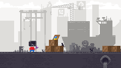

{:.full.pixels}

[Toolbx](https://github.com/containers/toolbox) is a tool for Linux operating systems, which allows the use of containerized command line environments. It is built on top of [Podman](https://podman.io/) and other standard container technologies from [OCI](https://opencontainers.org/).

This is particularly useful on [OSTree](https://ostree.readthedocs.io/en/latest/) based operating systems like
[Fedora CoreOS](https://coreos.fedoraproject.org/) and [Silverblue](https://silverblue.fedoraproject.org/). The intention of these systems is to discourage installation of software on the host, and instead install software as (or in) containers — they mostly don't even have package managers like DNF or YUM. This makes it difficult to set up a development environment or install tools for debugging in the usual way.

Toolbx solves this problem by providing a fully mutable container within which one can install their favourite development and debugging tools, editors and SDKs. For example, it's possible to do `yum install ansible` without affecting the base operating system.

However, this tool doesn't *require* using an OSTree based system. It works equally well on Fedora Workstation and Server, and that's a useful way to incrementally adopt containerization.

The toolbx environment is based on an [OCI](https://www.opencontainers.org/) image. On Fedora this is the `fedora-toolbox` image. This image is used to create a toolbx container that seamlessly integrates with the rest of the operating system by providing access to the user's home directory, the Wayland and X11 sockets, networking (including Avahi), removable devices (like USB sticks), systemd journal, SSH agent, D-Bus, ulimits, /dev and the udev database, etc..

## Installation & Use

See our [detailed guide](install).

## Articles & Blog Posts
#### 2021
* [Logging to registries with Toolbox](https://harrymichal.undo.it/posts/2021/logging-to-registries-with-toolbox/)
* [Toolbx, a developer's new best friend!](https://fedoramagazine.org/toolbx-a-developers-new-best-friend/)
* [We are now on Matrix](https://debarshiray.wordpress.com/2021/11/24/toolbx-is-now-on-matrix/)
* [Toolbx: Redhat is hiring a software engineer](https://debarshiray.wordpress.com/2021/11/15/toolbx-red-hat-is-hiring-a-software-engineer/)
* [Toolbox is now Toolbx](https://debarshiray.wordpress.com/2021/11/10/toolbox-is-now-toolbx/)
* [2021 update](https://debarshiray.wordpress.com/2021/01/14/toolbox-after-a-gap-of-15-months/)
* [Video talk -- Interactive container environment](https://www.youtube.com/watch?v=qdpg-zBvNz8) by Ondřej Míchal
#### 2020
* [Toolbox Status Update](https://harrymichal.undo.it/posts/2020/toolbox-status-update-v0.0.92-v0.0.96/)
* [A little collection of ‘How to do X with Toolbox on Fedora Silverblue’](https://harrymichal.undo.it/posts/2020/a-little-collection-of-how-to-do-x-with-toolbox-on-fedora-silverblue/)
#### 2019
* [Fedora Magazine -- a quick introduction to Toolbox](https://fedoramagazine.org/a-quick-introduction-to-toolbox-on-fedora/)
* [Toolbox -- a fall 2019 update](https://debarshiray.wordpress.com/2019/11/01/toolbox-a-fall-2019-update/)
* [Video talk -- Toolbox: using Silverblue for development](https://www.youtube.com/watch?v=BGXs0W6NRBM) by Debarshi Ray

## Press Information
We are very happy to answer questions from journalists and tech writers. The toolbox logo is licensed [CC-BY-SA 3.0](https://creativecommons.org/licenses/by-sa/3.0/) and can be [downloaded here](/assets/logo/toolbx-logo.zip).

Press queries, including requests for comments and interviews can be directed to [press@containertoolbx.org](mailto:press@containertoolbx.org).

## Get Involved
Toolbx is Free Software and is developed in the open. Code can be found on [GitHub](https://github.com/containers/toolbox).

  * Join us on Matrix at [#toolbx:matrix.org](https://matrix.to/#/#toolbx:matrix.org).
  * Issues are tracked on [GitHub Issues](https://github.com/containers/toolbox/issues).
  * Contributors are bound to agree to our [Code of Conduct](https://github.com/containers/common/blob/main/CODE-OF-CONDUCT.md).
  * Follow us on [Twitter](https://twitter.com/containertoolbx).
